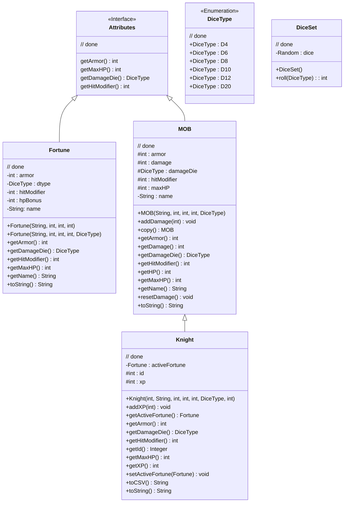
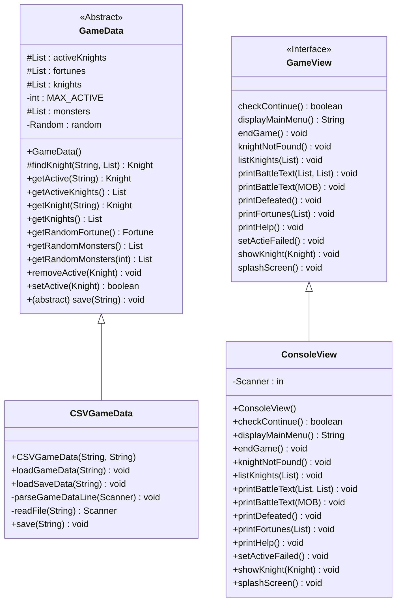
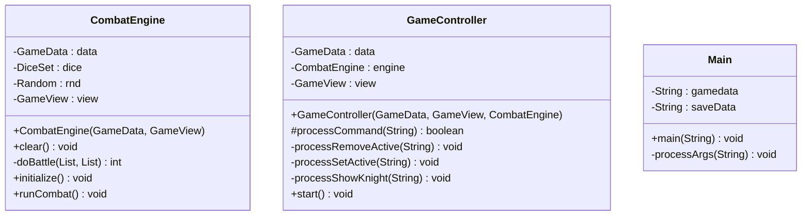

This following UML chart is generated by [Mermaid](http://mermaid-js.github.io/). If you are looking at it on your computer, and not through the browser, you may need to install an extension to view the graphics (or screenshot the browser version)

